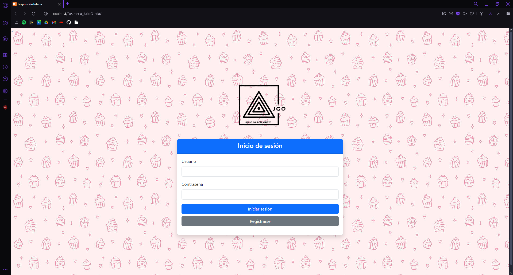
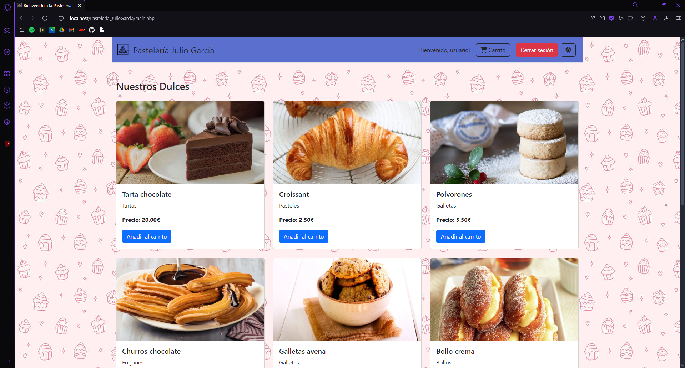
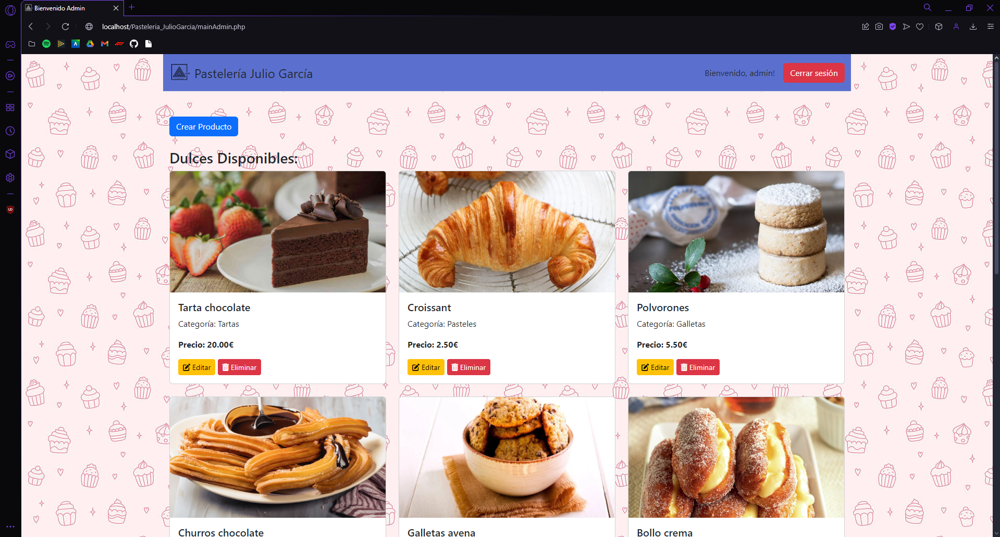

# 🧁 Pastelería Julio García

Este proyecto corresponde a una aplicación web para gestionar una pastelería, desarrollada en **PHP** con integración de bases de datos y funcionalidades de usuario. A continuación, se detalla la estructura y las principales funcionalidades de la aplicación.

---

## 🌟 Funcionalidades principales

### 👤 Usuarios
- **Registro y Login**: Los usuarios pueden registrarse y acceder a su cuenta a través de las páginas `registro.php` y `login.php`.
- **Gestión de sesión**: La sesión de usuario se gestiona utilizando cookies y sesiones.

### 🛠️ Administrador
- **Panel de administración**: 
  - El archivo `mainAdmin.php` permite a los administradores gestionar productos, visualizar clientes y realizar acciones como **editar**, **eliminar** o **añadir productos** a la base de datos.

### 🛒 Página principal
- **Visualización de productos**: 
  - Los usuarios pueden explorar los productos disponibles en la página principal `main.php`.
  - Funcionalidades incluidas:
    - **Añadir productos a la cesta.**
    - **Activar modo oscuro.**
    - **Cerrar sesión.**

### 🗄️ Base de datos
- **Estructura**: 
  - El archivo `Pasteleria.sql` incluye la definición de tablas para productos, clientes y registros de compras.
- **Conexión**: 
  - La clase `Conexion.php` se encarga de gestionar la conexión a la base de datos mediante PDO.

---

## 📂 Estructura de carpetas
- **`public/css`**: Contiene los estilos CSS para la aplicación.
- **`public/img`**: Imágenes de productos y logotipos.
- **`public/js`**: Scripts de JavaScript para mejorar la interactividad.
- **`public/src`**: Clases principales que implementan la lógica del negocio.
- **`public/util`**: Clases auxiliares como excepciones y la conexión a la base de datos.

---

## 🚀 Instalación y ejecución
1. **Clonar** el repositorio o descomprimir el archivo ZIP.
2. **Importar** el archivo `Pasteleria.sql` en un gestor de bases de datos MySQL.
3. Configurar el archivo `Conexion.php` con las credenciales correctas de la base de datos.
4. Asegurarse de que el servidor Apache esté configurado y que el módulo de PHP esté activo.
5. Acceder a la aplicación a través de un navegador web.

---

## ⚙️ Requisitos
- **PHP** 7.4 o superior (desarrollado con PHP 8.2.12).
- Servidor **Apache**.
- **MySQL**.

---

## 📝 Notas adicionales
- Este proyecto incluye un archivo `.git` para la gestión del control de versiones.
- La aplicación utiliza un enfoque modular para facilitar su mantenimiento y escalabilidad.

---

## 🌐 Login/Registro

  

---

## 🏠 Página principal
- Los usuarios pueden explorar productos y añadirlos a la cesta desde la página `main.php`.

  

---

## 🔑 Administrador
- El panel de administración, `mainAdmin.php`, permite a los administradores realizar gestiones avanzadas.

  

